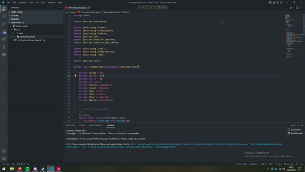

# Pomo-Clock
🍅 A simple pomodoro clock made using swing 🍅

# What is it? :thinking:
  
  A pomodoro clock is a clock that has 2 cycles, one 5 minute cycle and one 25 minute cycle, it is used mostly as a time management strategy, where the person using the pomodoro clock does their most important things in the 25 minute cycle, like studying for a test or doing work that needs to be done, and in the 5 minute cycle they take some time to rest, then after the 5 minute cycle is over the clock starts the 25 minute cycle all over again, and it does this until the person using the pomodoro clock decides that they wan't to stop the clock

# How does it work? :thinking:

  
  It is very simple to use this pomodoro clock, you have a start button, and a stop button. The start button starts the 25 minute cycle, this cycle will go on until it eventually starts the 5 minute cycle that will go on until the other cycle starts again, it will repeat this procces until you press the stop button, this button will completely restart the clock and also stop the timer.
  
# How to run the pomodoro clock :smile:
- 1st step: Download and install the most recent version of the jdk (this project was made with java 14, so you will need to have jdk version 14 or newer)
  
- 2nd step: In the github page for this project click on the "code" button and then click on "Download zip", this will download the zipped project folder to your computer
  
- 3rd step: Extract the zipped project folder to somewhere in your computer, then run the "Pomo-Clock.jar" file that is inside it.

After these three steps the project should be running in your pc, if it didn't run, i would recommend checking your java version to see if it really is newer than jdk 14 or if it isn't :slightly_smiling_face:.
